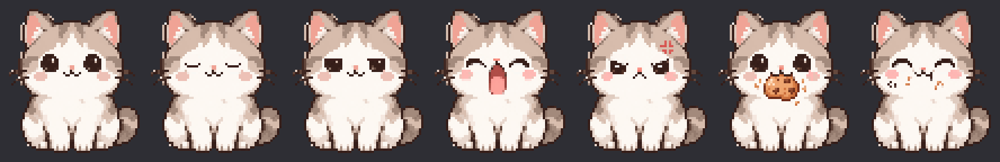

# 🐱 Pixel Cat

A tiny, charming pixel-art desktop cat companion for GNOME Shell on Linux / Wayland.

Its eyes follow your mouse cursor smoothly across screens, it blinks naturally, yawns cutely when you take a break, drifts off to sleep during long idle periods, and gets hungry with a grumpy face 😾💢 until you feed it a cookie! 🍪



> Built natively as a **GNOME Shell extension** (GNOME 45 – 50+ on Wayland / X11). On Wayland, ordinary desktop apps cannot read global mouse coordinates or display click-through overlays above all windows. Pixel Cat runs inside the GNOME compositor, giving you seamless cursor tracking and a persistent desktop pet with near-zero CPU and memory footprint.

---

## ✨ Features

- 👀 **Real-Time Eye Tracking**: Pupil positions calculate vector angles to your pointer 20 times per second, cleanly snapping to integer pixel coordinates so the pixel art stays razor sharp.
- 🤏 **Drag & Drop Placement**: Hold <kbd>Super</kbd> (Windows key) or <kbd>Alt</kbd> and left-click & drag to place your cat anywhere on your desktop. Positions persist across reboots.
- 🥱 **Drowsy & Yawning**: After inactivity, the cat yawns with a cute pink tongue before curling up to sleep. Any keypress or mouse movement immediately wakes it up!
- 😾 **Hunger & Feeding Interaction**: If neglected, the cat gets hungry—sporting an angry anime mark 💢 and grumpy speech bubbles. Click the cat to feed it a chocolate-chip cookie and watch it chomp happily with puffed cheeks!
- 💬 **Speech Bubbles & Quips**: Pops up gentle, customizable quips and purrs during idle sessions.
- ⚡ **Instant Testing & Rich Settings**:
  - Live test buttons in Settings: test <kbd>🥱 Yawn</kbd>, <kbd>😾 Hungry</kbd>, <kbd>😴 Sleep</kbd>, or <kbd>👀 Wake</kbd> on screen instantly!
  - Fully customizable timers (test in seconds or relax in minutes).
  - Multiple crisp integer scales (2×, 3×, 4×, 6×) for 1080p, 1440p, 4K, and Ultrawide displays.
- 🪟 **Wayland Native & Non-Intrusive**:
  - Completely click-through during normal use; never steals focus or intercepts clicks.
  - Automatically fades translucent when your cursor hovers over it.
  - Hides automatically when an application enters fullscreen (games, videos, presentations).
  - Pauses all timers and polling while asleep.

---

## 🚀 Quick Start (Fedora Workstation)

Pixel Cat comes with pre-compiled pixel-art assets ready to go. No compilation, Node, or Python dependencies are required for basic installation!

### 1. Install Dependencies

```bash
# Most are already installed on Fedora Workstation:
sudo dnf install gnome-shell gnome-extensions-app glib2-devel
```

### 2. Clone & Install

```bash
git clone https://github.com/sakincse21/PixelCat.git
cd PixelCat
bash install.sh
```

### 3. Log out and back in

On Wayland, GNOME Shell cannot restart in-place (`Alt`+`F2` `r` is disabled). Log out and log back in once. The cat will appear in your chosen desktop corner!

---

## ⚙️ Settings & Instant Testing

To customize timers, scales, or test states:

1. Open the **Extensions** app → **Pixel Cat** → ⚙ **Settings**, or run:
   ```bash
   gnome-extensions prefs pixelcat@sakin
   ```
2. **Instant Test Actions**:
   - Click <kbd>🥱 Yawn</kbd> to see the yawning animation.
   - Click <kbd>😾 Hungry</kbd> to trigger the angry hunger expression and cookie feeding mode.
   - Click <kbd>😴 Sleep</kbd> to put the cat to sleep immediately.
   - Click <kbd>👀 Wake</kbd> to wake it back up.
3. **Speed up timers for testing**:
   - Set **Fall asleep after** or **Gets hungry after** to `5`–`10` seconds to test the automatic timer transitions in real-time.

---

## 🎮 Desktop Controls

| Action       | Control                                        | Description                                                  |
| :----------- | :--------------------------------------------- | :----------------------------------------------------------- |
| **Move Cat** | <kbd>Super</kbd> or <kbd>Alt</kbd> + Left Drag | Reposition the cat anywhere on screen                        |
| **Feed Cat** | Left Click on Cat (when hungry)                | Feeds a cookie, triggering biting & chewing animations       |
| **Wake Cat** | Move mouse or press any key                    | Immediately wakes up a sleepy or yawning cat                 |
| **Fade**     | Hover cursor over Cat                          | Cat becomes translucent so it never obscures underlying text |

---

## 🎨 Sprite Layers

Pixel Cat uses layered rendering with pre-scaled nearest-neighbor integer assets:

| Layer         | State            | Description                                                                     |
| :------------ | :--------------- | :------------------------------------------------------------------------------ |
| `body`        | Awake            | Base body with cream eye sockets                                                |
| `eyes_open`   | Awake            | Pupils shifted by whole pixels following your cursor                            |
| `eyes_closed` | Sleeping / Blink | Closed eye slits during normal blinks and deep sleep                            |
| `eyes_half`   | Drowsy           | Half-lidded sleepy expression                                                   |
| `cat_yawn`    | Yawning          | Wide open yawning mouth with pink tongue                                        |
| `cat_angry`   | Hungry           | Angry brow, sharp glare, and anime anger mark 💢                                |
| `cat_food`    | Eating (Frame 1) | Chomping down on a chocolate-chip cookie                                        |
| `cat_chew`    | Eating (Frame 2) | Chewing happily with puffed cheeks `(( ))` and crumbs                           |

---

## 🛠️ Development & Building

Want to customize or develop new features?

```bash
# Symlink extension directly into your local GNOME Shell extensions folder:
bash install.sh --link

# Run JS syntax checks and unit tests:
make check

# View real-time filtered extension logs:
make logs

# Test safely in a nested Wayland shell without logging out:
make nested
```

> **Note on Assets**: High-resolution pre-scaled sprite layers (2×, 3×, 4×, 6×) are already pre-compiled and included directly in `extension/pixelcat@sakin/assets/`, so no Python build tools or image processors are required for users.

### Packaging for Release

Build an extensions bundle ready for installation or distribution:

```bash
make pack
# Output created at dist/pixelcat@sakin.shell-extension.zip
```

---

## 🗑️ Uninstalling

To completely disable and remove Pixel Cat:

```bash
bash uninstall.sh
```

---

## ❓ Troubleshooting

| Issue                              | Resolution                                                                                                         |
| :--------------------------------- | :----------------------------------------------------------------------------------------------------------------- |
| **Cat doesn't appear after login** | Check `gnome-extensions info pixelcat@sakin`. Run `make logs` to view GNOME Shell errors.                          |
| **Settings schema error**          | Run `make schemas` or re-run `bash install.sh` to compile GSettings schemas.                                       |
| **Sprites appear blurry**          | Make sure you are using an integer scale in Preferences (2×, 3×, 4×, 6×). Avoid fractional OS scaling if possible. |
| **Incompatible GNOME version**     | Run `bash install.sh` which automatically adds your running GNOME Shell major version to `metadata.json`.          |

---

## 🐦 Share on Twitter / X

If you love having Pixel Cat on your desktop, feel free to share it with fellow Linux and Fedora users!

Here is a ready-to-copy post template:

> Built a tiny pixel-art desktop companion for Fedora / GNOME Shell! 🐱✨
>
> His eyes follow your cursor, he yawns and takes naps when you're idle, and gets grumpy when he's hungry until you feed him cookies 🍪
>
> 100% Wayland-native, near-zero CPU.
>
> Check it out: https://github.com/sakincse21/PixelCat
> #Fedora #GNOME #Linux #PixelArt #Wayland

---

## 📄 License

This project is licensed under the [MIT License](LICENSE) — anyone is free to use, modify, and distribute it.
